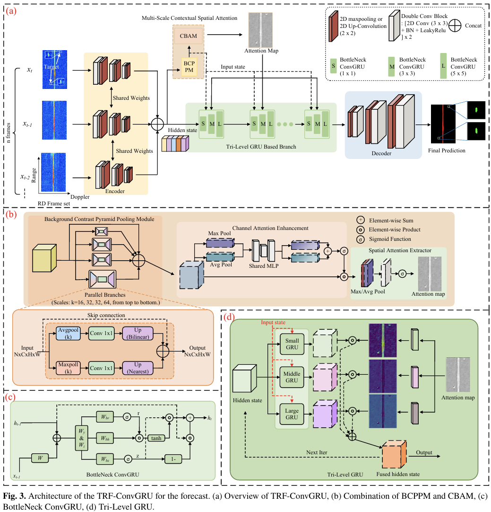
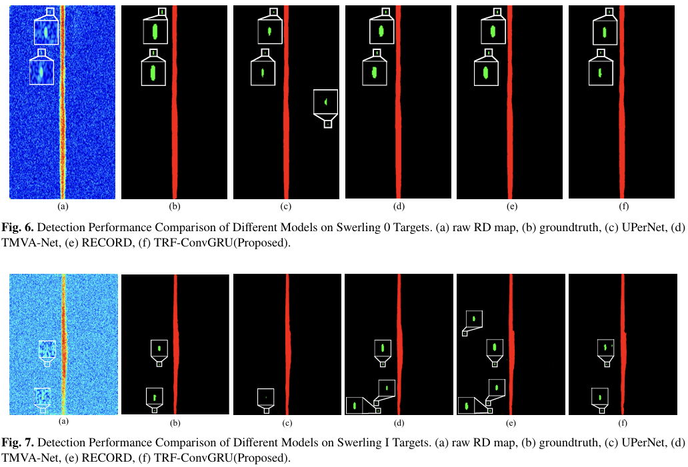

# TRF-ConvGRU: A Spatio-Temporal Network Based on Triple Level Receptive Fields GRU for Fluctuating Target Detection in OTHHR

**Junjie Xie**1,* · **Zhongtao Luo**1,+,✉️ · **Kun Lu**2 · **Zhiling Li**1 · **Zihan Li**1 · **Shengnan Shi**3

1CQUPT&emsp; 2NRIET&emsp; 3NJUPT
 
*First Author&emsp; †Project Leader&emsp; ✉️Corresponding Author

This work presents **TRF-ConvGRU**, a novel multiframe DL-based approach for fluctuating target detection in sky-wave over-the-horizon radar systems using spatio-temporal attention refinement module.

code will be release soon.

## Results

### Model Architecture

### Segmentation Results Comparison

## Citation

If you use this project in your research, please cite our paper.

🙏 Acknowledgements
The paper is currently under review. Special thanks will be indicated after final results.
Thank MVRSS for providing the basic model network foundation.
Thank the experts from Nanjing Research Institute of Electronics Technology (NRIET) for the time-range-Doppler dataset construction.
